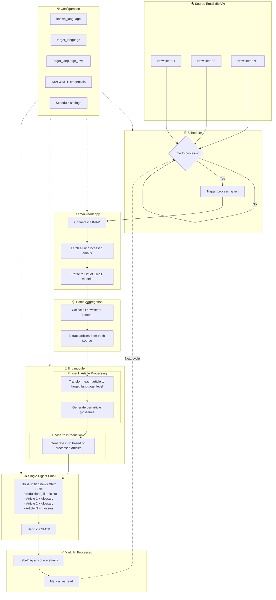

# PolyglotPigeon
## How it works?

```mermaid
flowchart TD
    subgraph Input["📥 Source Email (IMAP)"]
        A1[Newsletter 1]
        A2[Newsletter 2]
        A3[Newsletter N...]
    end

    subgraph Scheduler["⏰ Scheduler"]
        B{Time to process?}
        C[Trigger processing run]
    end

    subgraph EmailReader["📧 email/reader.py"]
        D[Connect via IMAP]
        E[Fetch all unprocessed emails]
        F[Parse to List of Email models]
    end

    subgraph Batching["📦 Batch Aggregation"]
        G[Collect all newsletter content]
        H[Extract articles from each source]
    end

    subgraph LLM["🤖 llm/ module"]
        subgraph Phase1["Phase 1: Article Processing"]
            I[Transform each article to target_language_level]
            J[Generate per-article glossaries]
        end
        subgraph Phase2["Phase 2: Introduction"]
            K[Generate intro based on processed articles]
        end
    end

    subgraph Output["📤 Single Digest Email"]
        M["Build unified newsletter:
        - Title
        - Introduction (all articles)
        - Article 1 + glossary
        - Article 2 + glossary
        - Article N + glossary"]
        N[Send via SMTP]
    end

    subgraph Cleanup["✅ Mark All Processed"]
        O[Label/tag all source emails]
        P[Mark all as read]
    end

    A1 & A2 & A3 --> B
    B -->|No| B
    B -->|Yes| C
    C --> D
    D --> E
    E --> F
    F --> G
    G --> H
    H --> I
    I --> J
    J --> K
    K --> M
    M --> N
    N --> O
    O --> P
    P -.->|Next cycle| B

    subgraph Config["⚙️ Configuration"]
        Q[known_language]
        R[target_language]
        S[target_language_level]
        T[IMAP/SMTP credentials]
        U[Schedule settings]
    end

    Config -.-> Scheduler
    Config -.-> EmailReader
    Config -.-> LLM
    Config -.-> Output
```
