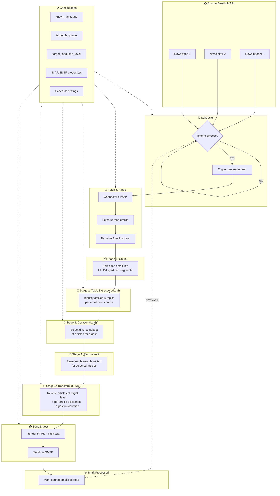

# PolyglotPigeon

Transform newsletters you already read into personalized language learning content — delivered to your inbox.

PolyglotPigeon monitors a source email inbox, batches incoming newsletters, and uses an LLM to rewrite the articles at your chosen CEFR level in your target language. Each article is accompanied by a glossary of words and phrases that may be unfamiliar at your level. A daily digest lands in your inbox ready to read.

## How it works




## Gmail setup

It is recommended to use a **dedicated Gmail account** as the source inbox rather than your primary email, so the app only ever reads newsletter emails.

### Enable IMAP on the source account

1. Open Gmail settings → **See all settings** → **Forwarding and POP/IMAP**
2. Under *IMAP access*, select **Enable IMAP** and save

### Create an app password (source account)

Gmail requires an app password when IMAP is accessed by a third-party app:

1. Make sure 2-Step Verification is enabled on the account (required for app passwords)
2. Go to **Google Account → Security → 2-Step Verification → App passwords**
3. Choose *Mail* and *Other (custom name)*, enter `PolyglotPigeon`, and click **Generate**
4. Copy the 16-character password — this goes into `source_email.app_password` in your config

### Subscribe newsletters to the source inbox

Forward or directly subscribe your chosen newsletters to the dedicated Gmail address. The app fetches all unread emails from the last 24 hours (configurable via `source_email.fetch_days`) and marks them as read after processing.

#### Choosing good source newsletters

PolyglotPigeon works best with newsletters that are:

- **Written in English** — other source languages may work unexpectedly for now
- **Text-focused** — the LLM reads the body text directly; newsletters that are mostly images or HTML tables produce poor results
- **Self-contained articles** — newsletters that summarise stories inline work well; newsletters that are only a list of links to external articles (with no body text) have nothing to rewrite
- **Not paywalled** — content that requires clicking through to a paywalled site will not be available to the pipeline
- **Delivered to your inbox in full** — some senders truncate the email and ask you to "read the rest online"; these produce short, incomplete digests

Good examples: [Semafor Flagship](https://www.semafor.com/newsletters/flagship), [Reuters Daily Briefing](https://www.reuters.com/newsletters/daily-briefing/), [The Download from MIT Technology Review](https://www.technologyreview.com/newsletters/the-download/).

### App password for the delivery (target) account

If you are sending the digest to a Gmail address via Gmail SMTP, you need a separate app password for that account as well, following the same steps above. That password goes into `target_email.smtp_password`.


## Configuration

Copy the example config and fill in your credentials:

```bash
cp src/polyglot_pigeon/config.example.yaml config.yaml
```

The `config.yaml` file is gitignored. See `config.example.yaml` for all available options with comments.

### Supported LLM providers

| Provider | `provider` field | Notes |
|---|---|---|
| OpenAI | *(omit)* | Default; set `api_key` and `model` (NOT YET TESTED) |
| Anthropic Claude | `claude` | Native SDK; set `api_key` and `model` |
| Perplexity | *(omit)* | OpenAI-compatible; set `url` to `https://api.perplexity.ai` (NOT YET TESTED)|
| Ollama (local) | *(omit)* | OpenAI-compatible; set `url` to `http://localhost:11434/v1` (NOT YET TESTED) | 

### Supported languages

`known` and `target` accept: `english`, `german`, `russian`, `italian`, `spanish`, `turkish`, `polish`

`level` accepts CEFR levels: `a1`, `a2`, `b1`, `b2`, `c1`, `c2`


## Running

### Single run (process now and exit)

Install dependencies and run once:

```bash
poetry install
poetry run python src/polyglot_pigeon/main.py -c config.yaml --run-once
```

This fetches all unread newsletters, builds a digest, sends it, and exits. Useful for testing your setup or triggering a manual run.

### Interactive pipeline runner

`utilities/run_pipeline.py` is an interactive script for running a manually selected batch of emails through the full pipeline. It is useful for development, prompt tuning, or verifying the output before deploying in daemon mode.

```bash
# Dry run — save the digest as HTML/text files instead of sending
poetry run python utilities/run_pipeline.py -c config.yaml --dry-run --output-dir ./output

# Fetch the last 3 days and send the result for real
poetry run python utilities/run_pipeline.py -c config.yaml --fetch-days 3
```

The script connects to your source inbox, lists the fetched emails, lets you pick which ones to include in the batch (by number or `all`), then runs the pipeline. With `--dry-run` the digest is saved locally; without it the digest is sent to the address configured in `target_email`.

### Daemon mode with Docker

The recommended way to run PolyglotPigeon continuously is with Docker. The container runs in daemon mode and processes emails on the schedule configured in `config.yaml`.

**Using the pre-built image (recommended):**

```bash
# Pull and start
docker compose -f docker-compose.prod.yml up -d

# View logs
docker compose -f docker-compose.prod.yml logs -f
```

`docker-compose.prod.yml` mounts your local `config.yaml` into the container (credentials are never baked into the image) and persists logs to a `./logs` directory.

**Building locally from source:**

```bash
docker compose up -d --build
```

**Stopping:**

```bash
docker compose down
```