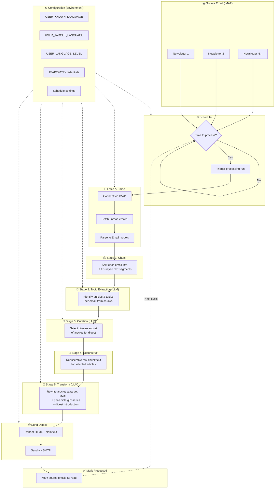

# PolyglotPigeon

Transform newsletters you already read into personalized language learning content — delivered to your inbox.

PolyglotPigeon monitors a source email inbox, batches incoming newsletters, and uses an LLM to rewrite the articles at your chosen CEFR level in your target language. Each article is accompanied by a glossary of words and phrases that may be unfamiliar at your level. A daily digest lands in your inbox ready to read.

## How it works


```mermaid
flowchart TD
    subgraph Input["📥 Source Email (IMAP)"]
        A1[Newsletter 1]
        A2[Newsletter 2]
        A3[Newsletter N...]
    end

    subgraph Scheduler["⏰ Scheduler"]
        B{Time to process?}
        C[Trigger processing run]
    end

    subgraph EmailReader["📧 Fetch & Parse"]
        D[Connect via IMAP]
        E[Fetch unread emails]
        F[Parse to Email models]
    end

    subgraph Stage1["📦 Stage 1: Chunk"]
        G[Split each email into\nUUID-keyed text segments]
    end

    subgraph Stage2["🤖 Stage 2: Topic Extraction (LLM)"]
        H[Identify articles & topics\nper email from chunks]
    end

    subgraph Stage3["🤖 Stage 3: Curation (LLM)"]
        I[Select diverse subset\nof articles for digest]
    end

    subgraph Stage4["🔗 Stage 4: Reconstruct"]
        J[Reassemble raw chunk text\nfor selected articles]
    end

    subgraph Stage5["🤖 Stage 5: Transform (LLM)"]
        K["Rewrite articles at target level
        + per-article glossaries
        + digest introduction"]
    end

    subgraph Output["📤 Send Digest"]
        L[Render HTML + plain text]
        M[Send via SMTP]
    end

    subgraph Cleanup["✅ Mark Processed"]
        N[Mark source emails as read]
    end

    A1 & A2 & A3 --> B
    B -->|No| B
    B -->|Yes| C
    C --> D --> E --> F
    F --> G --> H --> I --> J --> K
    K --> L --> M --> N
    N -.->|Next cycle| B

    subgraph Config["⚙️ Configuration (environment)"]
        Q[USER_KNOWN_LANGUAGE]
        R[USER_TARGET_LANGUAGE]
        S[USER_LANGUAGE_LEVEL]
        T[IMAP/SMTP credentials]
        U[Schedule settings]
    end

    Config -.-> Scheduler
    Config -.-> EmailReader
    Config -.-> Stage2
    Config -.-> Stage3
    Config -.-> Stage5
    Config -.-> Output
```


## Gmail setup

It is recommended to use a **dedicated Gmail account** as the source inbox rather than your primary email, so the app only ever reads newsletter emails.

### Enable IMAP on the source account

1. Open Gmail settings → **See all settings** → **Forwarding and POP/IMAP**
2. Under *IMAP access*, select **Enable IMAP** and save

### Create an app password (source account)

Gmail requires an app password when IMAP is accessed by a third-party app:

1. Make sure 2-Step Verification is enabled on the account (required for app passwords)
2. Go to **Google Account → Security → 2-Step Verification → App passwords**
3. Choose *Mail* and *Other (custom name)*, enter `PolyglotPigeon`, and click **Generate**
4. Copy the 16-character password — this goes into `IMAP_PASSWORD` in your `.env`

### Subscribe newsletters to the source inbox

Forward or directly subscribe your chosen newsletters to the dedicated Gmail address. The app fetches all unread emails from the last 24 hours (configurable via `IMAP_FETCH_DAYS`) and marks them as read after processing.

#### Choosing good source newsletters

PolyglotPigeon works best with newsletters that are:

- **Written in English** — other source languages may work unexpectedly for now
- **Text-focused** — the LLM reads the body text directly; newsletters that are mostly images or HTML tables produce poor results
- **Self-contained articles** — newsletters that summarise stories inline work well; newsletters that are only a list of links to external articles (with no body text) have nothing to rewrite
- **Not paywalled** — content that requires clicking through to a paywalled site will not be available to the pipeline
- **Delivered to your inbox in full** — some senders truncate the email and ask you to "read the rest online"; these produce short, incomplete digests

Good examples: [Semafor Flagship](https://www.semafor.com/newsletters/flagship), [Reuters Daily Briefing](https://www.reuters.com/newsletters/daily-briefing/), [The Download from MIT Technology Review](https://www.technologyreview.com/newsletters/the-download/).

### App password for the delivery (target) account

If you are sending the digest to a Gmail address via Gmail SMTP, you need a separate app password for that account as well, following the same steps above. That password goes into `SMTP_PASSWORD`.


## Configuration

All configuration comes from the environment. Copy the example file and fill in
your credentials:

```bash
cp .env.example .env
```

`.env` is gitignored. `.env.example` lists every variable the stack reads, with
defaults, and is the single place to look for what a fresh clone needs — the
application and `docker-compose.yml` both read it.

Anything without a default is required, and a service that starts without one
fails immediately, naming the variable:

```
pydantic_core._pydantic_core.ValidationError: 2 validation errors for ImapSettings
IMAP_ADDRESS
  Field required
IMAP_PASSWORD
  Field required
```

Each service reads only the variables it needs: `ingest` never sees
`LLM_API_KEY`, and `controller` never sees `IMAP_PASSWORD`.

### Supported LLM providers

| Provider | `LLM_PROVIDER` | Notes |
|---|---|---|
| OpenAI | *(omit)* | Default; set `LLM_API_KEY` and `LLM_MODEL` (NOT YET TESTED) |
| Anthropic Claude | `claude` | Native SDK; set `LLM_API_KEY` and `LLM_MODEL` |
| Perplexity | *(omit)* | OpenAI-compatible; set `LLM_URL` to `https://api.perplexity.ai` (NOT YET TESTED)|
| Ollama (local) | *(omit)* | OpenAI-compatible; set `LLM_URL` to `http://localhost:11434/v1` (NOT YET TESTED) |

### Supported languages

`USER_KNOWN_LANGUAGE` and `USER_TARGET_LANGUAGE` accept: `english`, `german`,
`russian`, `italian`, `spanish`, `turkish`, `polish`

`USER_LANGUAGE_LEVEL` accepts CEFR levels: `a1`, `a2`, `b1`, `b2`, `c1`, `c2`

> The `USER_*` variables are a temporary stand-in for a single user. They move
> to `users` and `subscriptions` rows once those tables exist (PP-09), and the
> bot takes over onboarding (PP-23).


## Database (for developers)

The project uses MySQL 8, SQLAlchemy and Alembic. There are no application
tables yet — this is infrastructure for upcoming tickets.

```bash
make db-up    # starts a MySQL 8 container (docker compose up -d db)
make migrate  # applies migrations (alembic upgrade head)
```

`make test` (`poetry run pytest -m "not mysql"`) runs the unit suite against
an in-memory SQLite database — no Docker needed, and this is what CI runs on
every PR. `tests/integration_tests/` covers MySQL- and Alembic-specific
behavior instead — charset handling, migrations, locking — and needs a live
database: `make test-integration` starts it, creates a separate `polyglot_test`
database (so a careless run can never touch a developer's local `polyglot`
data), migrates it, and runs the suite against it. Unlike the unit suite, an
unreachable database here is a test failure, not a skip — opt out explicitly
with `poetry run pytest -m "not mysql"` if you mean to.

Connection settings are read from `DB_HOST`, `DB_PORT`, `DB_USER`,
`DB_PASSWORD`, `DB_NAME` and `DB_CHARSET` — all optional in development, where
they default to match `docker-compose.yml`. Set `ENVIRONMENT=production` and
`DB_PASSWORD` must be supplied explicitly; the development default is refused.

## Running

### Single run (process now and exit)

Install dependencies and run once:

```bash
poetry install
poetry run python src/polyglot_pigeon/main.py --run-once
```

This fetches all unread newsletters, builds a digest, sends it, and exits. Useful for testing your setup or triggering a manual run.

### Interactive pipeline runner

`utilities/run_pipeline.py` is an interactive script for running a manually selected batch of emails through the full pipeline. It is useful for development, prompt tuning, or verifying the output before deploying in daemon mode.

```bash
# Dry run — save the digest as HTML/text files instead of sending
poetry run python utilities/run_pipeline.py --dry-run --output-dir ./output

# Fetch the last 3 days and send the result for real
poetry run python utilities/run_pipeline.py --fetch-days 3
```

The script connects to your source inbox, lists the fetched emails, lets you pick which ones to include in the batch (by number or `all`), then runs the pipeline. With `--dry-run` the digest is saved locally; without it the digest is sent to `USER_TARGET_EMAIL`.

### Daemon mode with Docker

The recommended way to run PolyglotPigeon continuously is with Docker. The container runs in daemon mode and processes emails on the schedule set by `USER_SEND_TIME` and `USER_TIMEZONE`.

**Using the pre-built image (recommended):**

```bash
# Pull and start
docker compose -f docker-compose.prod.yml up -d

# View logs
docker compose -f docker-compose.prod.yml logs -f
```

`docker-compose.prod.yml` passes your local `.env` into the container (credentials are never baked into the image) and persists logs to a `./logs` directory.

**Building locally from source:**

```bash
docker compose up -d --build
```

**Stopping:**

```bash
docker compose down
```