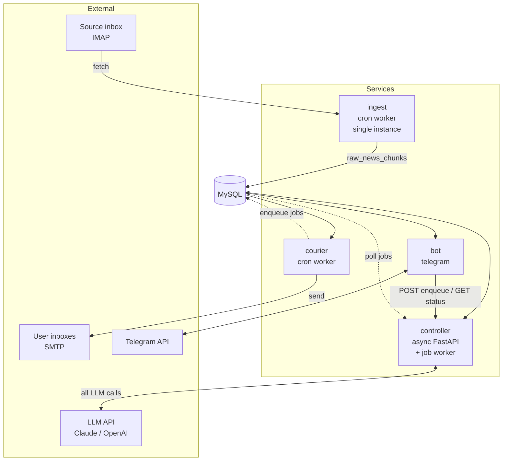
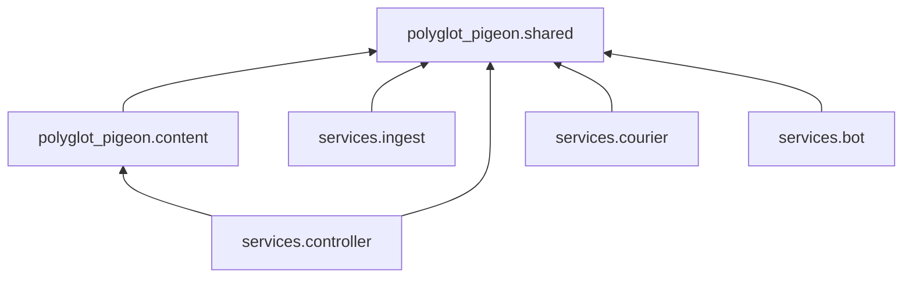
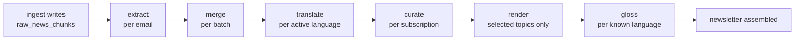
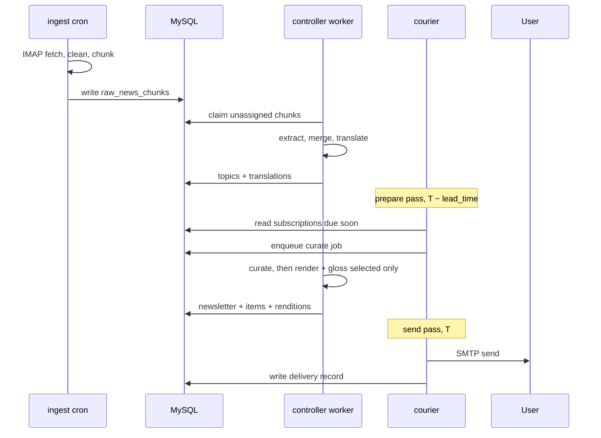
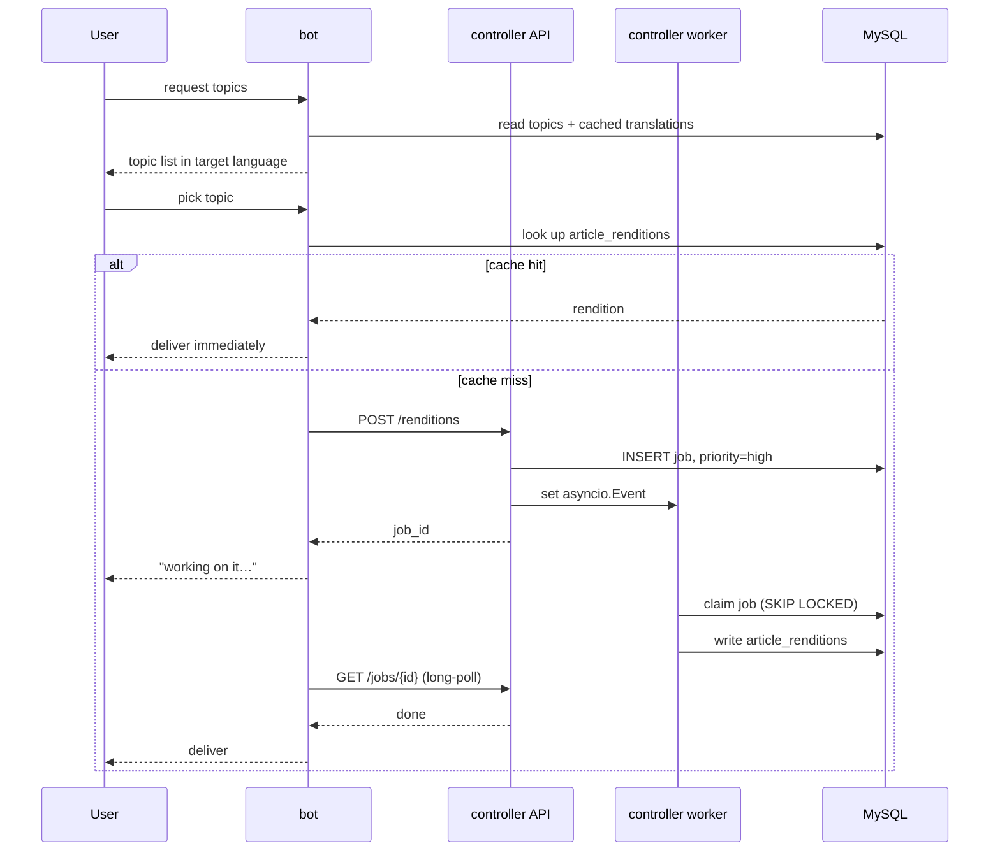

# PolyglotPigeon — Target Architecture

> **Status: proposal / draft.** Captures the decisions from the restructuring
> discussion. Not yet implemented. Open questions are listed at the end.

## 1. Why restructure

Today PolyglotPigeon is a single-tenant process: one `config.yaml` holds one
`LanguageConfig` and one `TargetEmailConfig`, reached globally through the
`ConfigLoader` singleton (`get_config()` in `pipeline.py`, `scheduler.py`,
`mock_bot.py`). There is no database and no concept of a user.

Adding a Telegram bot forces three changes at once:

1. **Multi-tenancy** — many users, each with their own language config and
   subscriptions. This is the largest change and a hard prerequisite for
   everything else.
2. **Persistence** — a SQL database, replacing "fetch and send in one pass".
3. **Multiple delivery channels** — email and Telegram, with different
   lifecycles (email is delivery-only; the bot is delivery *and* an
   interactive client).

The service split below follows from those, not the other way around.

### Sequencing

The multi-tenancy refactor is roughly 5–10× the work of splitting processes.
Doing it *after* a split means doing it three times, in three codebases.

**Introduce the database and the user/subscription model inside the current
monolith first. Split out processes once the data model has stopped moving.**

---

## 2. Services

Four deployables, one repository.

| Service | Trigger | Blocking I/O | Calls LLM |
|---|---|---|---|
| `ingest` | cron (APScheduler) | IMAP | no |
| `controller` | HTTP + job polling | **none** | **yes — exclusively** |
| `courier` | cron (per-user schedule) | SMTP | no |
| `bot` | Telegram updates | none | no |

### `ingest`
Fetches source newsletters over IMAP on a schedule, cleans the text
(imperfectly — the LLM tolerates noise) and chunks it into `raw_news_chunks`.
Exposes no API and talks to no other service; it fills a table on a timer and
exits.

**Single instance by design.** Two replicas would double-fetch the inbox. That
constraint — not dependency isolation — is the main reason it stays a separate
process from the horizontally-scalable controller.

### `controller`
Async FastAPI. **Owns every LLM call in the system** and runs the job worker
that performs them: topic extraction, cross-source merging, title translation,
article rendering, and per-user curation.

Its HTTP surface is a **control plane, not a work plane** — endpoints enqueue
and observe jobs, they never perform the work in-request:

| Endpoint | Purpose |
|---|---|
| `POST /renditions` | enqueue a render; returns `job_id` immediately |
| `GET /jobs/{id}` | job status; long-polls until done or timeout |
| `GET /health` | liveness |

Because IMAP lives in `ingest` and SMTP lives in `courier`, the controller
touches only the database and async LLM clients — no `asyncio.to_thread()`
shims, no way to accidentally block the event loop.

> **Why the controller owns all LLM access.** If `ingest` called the LLM
> directly, two services would be uncoordinated consumers of one rate limit,
> and a large nightly ingest batch could starve a user waiting in Telegram. A
> single worker with a `priority` column lets interactive work jump the batch
> queue. It also keeps `_parse_json_with_retry` and token/cost accounting in
> one place instead of fragmenting them across services.
>
> This costs no coupling, because **ingest never waits**: it writes chunks,
> and walks away. If the controller is down, ingest keeps collecting mail and
> extraction simply backs up. Nothing is lost.

### `courier`
Ticks on a fixed interval and works from `subscriptions.next_run_at`. Each tick
makes two passes: a **prepare** pass that enqueues a `curate` job for every
subscription due within `lead_time`, and a **send** pass that assembles the
already-rendered articles for subscriptions due now, sends over SMTP, and
records the delivery. It never calls the LLM and never calls the controller's
API — it enqueues straight to the `jobs` table.

### `bot`
Telegram interface. Reads stored content directly for anything already
rendered (instant, no coordination). Lets the user pick topics themselves, and
enqueues jobs for anything not yet generated. Also the onboarding surface —
which is why it owns `users` and `subscriptions`.

---

## 3. System overview



**Data flows through the database; only control signals use HTTP.** All content
is read and written via the shared repository layer. The single HTTP path —
`bot` → `controller` — carries no payload work: it enqueues a job and observes
its status (§2). Latency-insensitive producers like `courier` skip it and
enqueue straight to the `jobs` table.

---

## 4. Repository layout

```
polyglot-pigeon/
├── src/polyglot_pigeon/         # one import root (see below)
│   ├── shared/                  # used by all services
│   │   ├── models/              # Pydantic models: User, Subscription, Topic…
│   │   ├── config/              # env-based settings (replaces YAML singleton)
│   │   └── db/                  # engine, session, repositories/  ← the seam
│   ├── content/                 # LLM-facing domain logic — ONLY controller uses it
│   │   ├── prompts/
│   │   ├── llm/                 # async-capable clients
│   │   ├── extractor.py         # topic extraction + merge
│   │   ├── translator.py        # topic title translation
│   │   └── composer.py          # article rendering (generation half of pipeline.py)
│   └── services/
│       ├── ingest/              # + cleaner.py, chunker.py (no LLM deps)
│       ├── controller/
│       ├── courier/
│       └── bot/
├── migrations/                  # single Alembic tree
├── tests/                       # mirrors src/polyglot_pigeon/
├── pyproject.toml               # one distribution for the whole repo
└── docker-compose.yml
```

**Everything lives under a single `polyglot_pigeon` import root.** With one
distribution (§10), the alternative — `packages/` and `services/` as top-level
directories — would make `shared`, `content`, `ingest` and `bot` top-level
*import names*, four of which are plausible names on PyPI and any of which a
future transitive dependency could shadow silently. The shared/service
distinction is therefore expressed as a module path, not a directory tier. It
costs nothing: the dependency rule below is unchanged, and it reads more
precisely as `polyglot_pigeon.services.*` than as a folder name.

**Services are started as modules** — `python -m polyglot_pigeon.services.courier`,
with a `__main__.py` per service — not through `[project.scripts]` console
entry points. Nothing to keep in sync, and the container `CMD` names the
service it runs.



**Rule: services may import `shared` and `content`; services may never import
each other.** Enforce with `import-linter` — under a single distribution (§10)
it is the *only* enforcement, so it is not optional tooling:

```toml
[[tool.importlinter.contracts]]
name = "services may not import each other"
type = "independence"
modules = [
  "polyglot_pigeon.services.ingest",
  "polyglot_pigeon.services.controller",
  "polyglot_pigeon.services.courier",
  "polyglot_pigeon.services.bot",
]
```

Only `controller` imports `polyglot_pigeon.content`, so `ingest`, `courier` and
`bot` need no `anthropic` or `openai` — enforced statically everywhere, and
additionally at install time wherever a service is installed through its own
extra (§10). Cleaning and chunking are pure text manipulation and live in
`ingest` directly.

### Required refactors

- **`pipeline.py` splits three ways.** `_extract_topics` and
  `_transform_articles` → `polyglot_pigeon/content` (controller); `send_target_email`
  → `courier`; chunking/cleaning → `ingest`.
- **`ConfigLoader` singleton goes away.** Per-user settings move to database
  rows; process settings move to env-based config.
- **LLM calls switch to the async path.** `llm/client.py` already implements
  `complete_async` with `AsyncAnthropic` / `AsyncOpenAI` — but nothing calls
  it; `pipeline.py` uses the sync `complete()`. Wiring this up enables
  `asyncio.gather()` over independent per-email extraction calls, the largest
  available latency win.

---

## 5. Data ownership

**One writer per table, no exceptions.**

| Table group | Writer | Readers |
|---|---|---|
| `newsletter_sources` | `ingest` (upsert on first sight) | all |
| `source_emails` (incl. `newsletter_source_id`), `raw_news_chunks` | `ingest` | controller |
| `news_topics`, `news_topic_sources`, `article_renditions`, `glossaries` | `controller` | courier, bot |
| `texts` (`DYNAMIC` rows) | `controller` | courier, bot |
| `texts` (`STATIC` rows) | migrations only (authored, seeded with code) | controller, courier, bot |
| `translations` | `controller` (LLM `translate` job) | courier, bot |
| `languages` | migrations only (seeded reference data) | all |
| `newsletters`, `newsletter_items` | `controller` | courier, bot |
| `deliveries` | `courier` | — |
| `users`, `user_languages`, `subscriptions`, `user_newsletter_sources`, `bot_sessions` | `bot` | ingest, controller, courier |
| `jobs` | `controller` (on its own behalf, or for `bot` via HTTP); `courier` enqueues directly | — |

All access goes through repositories in `polyglot_pigeon/shared/db`. No service writes
raw SQL against another's tables.

### Why repositories

The repository interface — not the network boundary — is the seam. If true
service separation is ever needed, swap the repository implementation for an
HTTP client and callers don't change. This buys the design benefit now and
defers the operational cost (API versioning, serialization, lost transactions,
harder local dev) until it is justified.

### Availability test

> If the controller is down, can `courier` still send today's already-rendered
> newsletters?

Under this design, **yes** — courier reads renditions and subscriptions
directly. If the answer were no, the controller would not be a controller but a
single point of failure wrapped around the database, and a single process would
have been the better choice.

---

## 6. Data model

### The core principle: shared renditions, per-user selection

**Generated content is shared; only the selection is per-user.**

| Artifact | Key | Shared? |
|---|---|---|
| `news_topics` | — | globally |
| `translations` | `(text, language)` | per language |
| **`article_renditions`** | `(topic, language, level)` | **per language + level** |
| `glossaries` | `(rendition, known_language)` | per known language |
| `newsletters` | `(user, date)` | no — a *selection* |
| curation choice | `(user, batch)` | no |

A newsletter is a **per-user assembly of shared, cached article renditions**.
Two B2 Spanish learners who both receive the EU-regulation story consume the
*same* generated text; only their selection differs.

Consequence: **LLM cost scales with distinct `(topic × language × level)`
combinations, not with user count.** Ten B2 Spanish users cost the same as one.
This is decided entirely by the absence of a `user_id` column on
`article_renditions` — it must not have one.

Note the deliberate asymmetry: titles key on `(topic, language)` while content
keys on `(topic, language, level)`. A headline does not meaningfully differ
between A2 and C1; putting `level` in the title cache would multiply
translation cost sixfold for no benefit.

Curation is the one genuinely per-user LLM call, so it runs over **titles and
short summaries only, never full content**, keeping per-user cost negligible.

```mermaid
erDiagram
    NEWSLETTER_SOURCES ||--o{ SOURCE_EMAILS : "delivers"
    NEWSLETTER_SOURCES ||--o{ USER_NEWSLETTER_SOURCES : "followed via"
    USERS ||--o{ USER_NEWSLETTER_SOURCES : "follows via"
    NEWSLETTER_SOURCES ||--o{ NEWS_TOPIC_SOURCES : "contributes via"
    NEWS_TOPICS ||--o{ NEWS_TOPIC_SOURCES : "sourced via"
    NEWSLETTER_SOURCES ||--o{ NEWSLETTER_SOURCE_TAGS : "tagged via"
    TAGS ||--o{ NEWSLETTER_SOURCE_TAGS : "applied via"
    NEWS_TOPICS ||--o{ NEWS_TOPIC_TAGS : "tagged via"
    TAGS ||--o{ NEWS_TOPIC_TAGS : "applied via"
    SOURCE_EMAILS ||--o{ RAW_NEWS_CHUNKS : "chunked into"
    RAW_NEWS_CHUNKS }o--o| NEWS_TOPICS : "assigned to"
    NEWS_TOPICS ||--o{ TEXTS : "has"
    NEWS_TOPICS ||--o{ ARTICLE_RENDITIONS : "rendered as"
    NEWS_TOPICS }o--o| NEWS_TOPICS : "merged into"
    USERS ||--o{ USER_LANGUAGES : learns
    USER_LANGUAGES ||--o{ SUBSCRIPTIONS : "delivered via"
    SUBSCRIPTIONS ||--o{ NEWSLETTERS : produces
    NEWSLETTERS ||--o{ NEWSLETTER_ITEMS : contains
    ARTICLE_RENDITIONS ||--o{ NEWSLETTER_ITEMS : "included as"
    NEWSLETTERS ||--o{ DELIVERIES : "sent as"
    LANGUAGES ||--o{ ARTICLE_RENDITIONS : "target of"
    ARTICLE_RENDITIONS ||--o{ GLOSSARIES : "glossed in"
    LANGUAGES ||--o{ GLOSSARIES : "known side"
    LANGUAGES ||--o{ USER_LANGUAGES : "target of"
    LANGUAGES ||--o{ USERS : "known by"
    TEXTS ||--o{ TRANSLATIONS : "translated as"
    LANGUAGES ||--o{ TRANSLATIONS : "target of"

    LANGUAGES {
        string code PK "ISO 639-1"
        string name_en
        string name_native
    }
    TEXTS {
        int id PK
        enum text_type "STATIC, DYNAMIC"
        string text_key UK "static only, e.g. bot.menu.back"
        int topic_id FK "dynamic only"
        enum kind "dynamic only: TITLE, SUMMARY"
    }
    TRANSLATIONS {
        int text_id FK
        string language_code FK
        text content
        string source_hash "static only: staleness"
        datetime created_at "source resolution tiebreak"
    }
    NEWSLETTER_SOURCES {
        int id PK
        string name "e.g. Reuters — Daily Brief"
        string outlet "e.g. Reuters"
        string identifier UK "List-Id or from-address"
    }
    SOURCE_EMAILS {
        int id PK
        int newsletter_source_id FK
        string message_id
        datetime fetched_at
    }
    NEWS_TOPIC_SOURCES {
        int news_topic_id FK
        int newsletter_source_id FK
    }
    USER_NEWSLETTER_SOURCES {
        int user_id FK
        int newsletter_source_id FK
    }
    TAGS {
        int id PK
        string name UK
    }
    NEWSLETTER_SOURCE_TAGS {
        int newsletter_source_id FK
        int tag_id FK
    }
    NEWS_TOPIC_TAGS {
        int news_topic_id FK
        int tag_id FK
    }
    RAW_NEWS_CHUNKS {
        int id PK
        int source_email_id FK
        text content
        int position
        int topic_id FK "nullable"
        string extraction_status
        int attempts
    }
    NEWS_TOPICS {
        int id PK
        int canonical_topic_id FK "nullable"
        datetime created_at
    }
    ARTICLE_RENDITIONS {
        int topic_id FK
        string language_code FK
        enum level "A1..C2"
        text content
    }
    GLOSSARIES {
        int rendition_id FK
        string known_language_code FK
        json entries "phrase to gloss"
    }
    USERS {
        int id PK
        int telegram_id
        string email
        string known_language_code FK
        string timezone "IANA, e.g. Europe/Warsaw"
    }
    USER_LANGUAGES {
        int user_id PK-FK
        string language_code PK-FK
        enum level "A1..C2"
    }
    SUBSCRIPTIONS {
        int id PK
        int user_id FK
        string language_code FK
        enum channel "EMAIL, TELEGRAM"
        set days_of_week "MON..SUN, NULL = on-demand"
        time send_time "local wall time"
        datetime next_run_at "UTC, materialized"
    }
    NEWSLETTERS {
        int id PK
        int subscription_id FK
        datetime scheduled_for "UTC"
        datetime created_at
    }
    NEWSLETTER_ITEMS {
        int newsletter_id FK
        int rendition_id FK
    }
    DELIVERIES {
        int id PK
        int newsletter_id FK
        datetime sent_at
        string status
    }
```

Unique constraints: `translations(text_id, language_code)`,
`article_renditions(topic_id, language_code, level)`, and
`glossaries(rendition_id, known_language_code)`. These are what make the cache
a cache. Also `newsletter_sources(identifier)` (one row per distinct newsletter)
and `newsletters(subscription_id, scheduled_for)` — the latter is what makes a
delivery retry idempotent rather than duplicating a newsletter (§7). Plus
composite primary keys on the junctions
`news_topic_sources(news_topic_id, newsletter_source_id)`,
`user_newsletter_sources(user_id, newsletter_source_id)` and
`user_languages(user_id, language_code)`.

### Newsletter sources: provenance and per-user visibility

A `newsletter_source` is one real newsletter we signed up to — "Reuters — Daily
Brief", "Semafor Flagship". Two newsletters from the same outlet are **two rows**:
`identifier` (the `List-Id` header, or failing that the from-address) is the unique
key, so "Economist Daily Brew" and "Economist Europe Daily" never collapse together.

The catalog is **populated lazily by `ingest`, not seeded up front**. On each fetch,
`ingest` derives the `identifier` from the email headers and upserts the source
(`INSERT ... ON DUPLICATE KEY UPDATE` on the `identifier` UK) — the first email from a
new newsletter creates its row — then stamps the email with the resulting
`newsletter_source_id`. `ingest` is single-instance (§2), so the upsert has no race.
`name` and `outlet` are filled best-effort from the `List-Id` description / `From`
display name on creation and can be tidied later without affecting `identifier`.

A topic links back to sources through **`news_topic_sources`, a many-to-many
junction** — one `news_topic` can be fused from content across several outlets, and
each keeps its provenance. This table is **materialized at extract/merge time, not
derived on read**: tracing topic → chunks → source_emails would be a three-join
across the largest table and would break once chunks are purged (see retention,
§11). `controller` writes it as it assigns chunks to topics.

Users follow sources through **`user_newsletter_sources`**, a plain follow list
owned by `bot`. Following is user-level, independent of channel/language/level
(those live in `subscriptions`) — per-subscription source filtering is deliberately
deferred (§11). A topic is shown to a user when they follow **at least one** of its
sources:

```sql
SELECT DISTINCT nts.news_topic_id
FROM news_topic_sources nts
JOIN user_newsletter_sources uns USING (newsletter_source_id)
WHERE uns.user_id = ?
```

> **Merge invariant.** When a topic is merged into a canonical one
> (`canonical_topic_id`), its `news_topic_sources` rows must be unioned onto the
> canonical topic. Skip this and a user who follows only the absorbed topic's source
> loses visibility of it after the merge.

**Tags (schema only, deferred).** A `tags` catalog with two junctions —
`newsletter_source_tags` and `news_topic_tags` — lets both sources and topics carry
free-form labels (M:N on each side). The tables are reserved in the data model now;
**how tags are created, assigned, and used is out of scope** and intentionally left
for later, so no owner is assigned in §5 yet.

### Glossaries: shared phrases, per-known-language glosses

The article body depends on `(topic, language, level)`. The glossary depends on
those **plus `known_language`** — a Polish and a German speaker learning B2
Spanish share the prose but not the word list. Rather than adding
`known_language` to the rendition key (which would duplicate the expensive
prose for a difference that only affects the glosses), the glossary splits out:

| | key | produced by |
|---|---|---|
| `article_renditions.content` | `(topic, language, level)` | the expensive `render` job |
| `glossaries.entries` | `+ known_language` | a `gloss` job over existing content |

On a cache miss the glossary is **generated from the rendition's article text**,
with the known language and the rendition's CEFR level in the prompt:

```
lookup glossaries(rendition, known_language)
  hit  → return
  miss → send rendition.content + known_language + level to LLM
         → INSERT glossary
```

Two properties follow from generating rather than translating a stored word
list:

- **Phrase selection becomes known-language aware for free.** The LLM sees who
  is reading, so an English speaker isn't glossed German *Information* while a
  Polish speaker is. Selection legitimately differs per known language, which
  is why no shared phrase list is stored.
- **Glossing happens in context.** The model disambiguates from the surrounding
  sentence — German *Rechnung* is glossed as *invoice*, never as a bird's bill.
  Pivoting through another language's glossary, or machine-translating a bare
  phrase list, would lose exactly that context.

The article body is still rendered once per `(topic, language, level)` and
shared; only the glossary multiplies by known language. A `gloss` job is far
cheaper than a `render` — it reads existing text rather than composing new
prose — so the cost profile in §6 holds.

> By the same argument as §2, `gloss` is a job type owned by the controller,
> not a direct call from `bot` or `courier`.

### Translatable text: two parallel pairs

Every translatable string follows the same shape — **an identity row that holds
no text, plus one translation row per language.** English is not special-cased;
it is simply the row whose `language_code = 'en'`.

One `texts` table holds every identity row, discriminated by `text_type`; one
`translations` table holds all the content.

| `text_type` | identified by | populated by |
|---|---|---|
| `STATIC` | `key` (`bot.menu.back`) | keys by migration, translations by LLM |
| `DYNAMIC` | `topic_id` + `kind` | entirely by LLM at runtime |

Static keys are namespaced dotted paths and are **authored, not generated** —
seeded by migration alongside the code that references them, so a missing key
is a deploy-time error rather than a runtime blank.

Topic titles take the path **`news_topics` → `texts` → `translations` (`en`)**.
`kind` exists so a topic can later carry a summary or teaser through the same
machinery without a schema change.

> Storing UI strings in the database rather than in `.po`/JSON files is a
> deliberate deviation from convention. It is consistent with the rest of the
> design — languages are data, so adding one must not require a redeploy — but
> it trades away version-controlled, PR-reviewable copy. Static text is no
> longer visible in code review at all; only its key is.

#### Consequences of holding no text in the identity table

- **`news_topics.title_en` is gone.** Every topic listing now joins
  `news_topics → texts → translations`. More normalized, one extra join on the
  bot's hottest query — index accordingly.
- **The source language is resolved, not stored.** With no `source_text`
  column, "what was this translated *from*" is no longer structural. Rather
  than a `source_language_code` column, it is a lookup rule:

  ```
  source = translations WHERE language_code = 'en'
           ELSE the oldest translation row for this text
  ```

  This is why `translations.created_at` exists — without it "oldest" has no
  definition, and relying on auto-increment order would work only by accident.
  Note the consequence: if an `en` row is added *later* to a text that already
  had translations, the resolved source changes, and existing `source_hash`
  values will compare against a different row. Harmless for content, but it
  will make everything look stale exactly once.
- **Staleness is measured between rows.** `source_hash` on a static translation
  records the hash of the source-language translation at the time it was made;
  a mismatch means "re-translate me". Null for dynamic rows, which are never
  edited after generation.

#### Making the discriminator safe

A single table with a `text_type` discriminator means each row uses only some
of its columns. Left unconstrained this is the **One True Lookup Table**
anti-pattern (also "MUCK" — Massively Unified Code-Key table), where nothing
stops a static row from carrying a `topic_id`. Three things keep it honest:

- **`topic_id` is a real foreign key**, not a key string like
  `"topic:1234:title"`. This is the load-bearing decision: it preserves
  referential integrity, makes `ON DELETE CASCADE` handle retention cleanup
  automatically (topic → texts → translations), and keeps topic lookups on an
  indexed join.
- **A `CHECK` constraint enforces the discriminator** (MySQL 8.0.16+ enforces
  these rather than parsing and ignoring them):

  ```sql
  CHECK ((text_type = 'STATIC'  AND key IS NOT NULL AND topic_id IS NULL)
      OR (text_type = 'DYNAMIC' AND key IS NULL AND topic_id IS NOT NULL))
  ```

- **Two partial-by-nullability unique indexes**: `UNIQUE(key)` and
  `UNIQUE(topic_id, kind)`. These coexist because MySQL permits repeated NULLs
  in a unique index — every dynamic row has `key IS NULL`, every static row has
  `topic_id IS NULL`, so each constraint only bites on the rows it applies to.
  That behaviour is load-bearing here; it is also the most commonly
  misunderstood corner of MySQL unique indexes.

**Residual cost:** thousands of ephemeral topic rows share a table with the ~50
UI strings read on every bot interaction. At this scale a covering index on
`(text_type, key)` makes that a non-issue — but it is the reason to keep
`text_type` indexed rather than treating it as decoration.

### Naming conventions

| | Convention | Example |
|---|---|---|
| Tables | lowercase `snake_case`, **plural** | `article_renditions` |
| Columns | lowercase `snake_case`, singular | `known_language_code` |
| Foreign keys | `<singular_table>_id` | `topic_id`, `rendition_id` |
| SQLAlchemy models | `PascalCase`, **singular** | `ArticleRendition` |

Lowercase is not stylistic: MySQL table names are case-**sensitive** on Linux
and case-**insensitive** on macOS/Windows (`lower_case_table_names`). A
`NewsTopics` table works on a developer laptop and breaks on the server.

Avoid MySQL reserved words in column names. `texts.key` would have been one —
hence `text_key`. Reserved-word columns work only when quoted everywhere, and
tooling does not always quote them.

### Why `language` is a table but `level` and `channel` are enums

The distinction is whether the set can grow **without a code change**:

| | Modelled as | Why |
|---|---|---|
| `language` | **table** | Extensible. Adding Portuguese is a data change — the pipeline is already language-agnostic. Also carries metadata (`name_en`, `name_native` for the bot's language picker). |
| `level` | **enum** | CEFR is a fixed external standard. Six values, A1–C2, ordered. It will not grow. |
| `channel` | **enum** | Adding a channel means writing a delivery implementation, so it can never be data-only. |
| `days_of_week` | **MySQL `SET`** | Seven values, fixed forever — the same argument as `level`, applied to a set rather than a single value. Native `SET` stores it in one byte but reads and queries as labels (`MON,TUE,WED,THU,FRI`), so the schedule stays legible and stays on one row. |

`language_code` uses the ISO 639-1 code as a natural primary key rather than a
surrogate int: the set is small and stable, and it keeps `es` / `pl` legible in
queries and logs without a join.

Note this supersedes the `Language` enum in `models/configurations.py:31` —
once languages are rows, the table is the source of truth and the Python enum
must go, or the two will drift.

`level` and `channel` map to Python enums (`LanguageLevel` already exists at
`models/configurations.py:41`) and to MySQL `ENUM` columns. Order matters for
`level`, so store it in a way that sorts correctly — MySQL `ENUM` sorts by
declaration order, which is what you want.

### Extraction is two passes, not one

Extracting topics across a whole batch is what deduplicates a story covered by
two different sources. But sending every unassigned chunk in one LLM call is
unbounded — 15 newsletters × 30 chunks exceeds a comfortable context, degrades
assignment quality, and loses the entire batch on one failure.

```
pass 1  per source email, parallel   chunks → candidate topics
pass 2  per batch, single call       candidate topics → merged topics + English title
```

Pass 2 sees only titles, never chunk text, so it stays small regardless of
batch size. Pass 1 preserves today's per-email failure isolation.

### `topic_id IS NULL` is not a work queue

Two failure modes make the null-FK approach unworkable on its own:

- A chunk that permanently fails extraction stays `NULL` and is retried in
  every subsequent batch until it ages out of the window. Hence
  `extraction_status` + `attempts`.
- Two controller replicas would claim the same chunks. Claiming uses
  `SELECT … FOR UPDATE SKIP LOCKED` — one of the reasons for MySQL over
  SQLite.

Also note `raw_news_chunks.topic_id` means **one topic per chunk**. A chunk
covering two stories cannot be expressed. Acceptable at current chunk
granularity, but it is a constraint, not a free property.

### Translation timing

Translating "when the user picks a language" does not work: topics keep
arriving after that moment.

Instead, **after extraction, enqueue one `translate` job per *active
language*** — the distinct set of languages any user currently has selected.
Cost scales with distinct languages, not users, and one call translates a whole
batch of titles. The bot then never waits, because translations exist by the
time topics do. Lazy translation remains the fallback for a language that
becomes active mid-cycle.

---

## 7. Flows

### Job types

Every job is **executed by the `controller`** — that is what "the controller
owns all LLM calls" means in practice. Services differ only in what they
*enqueue*.

| Job | Enqueued by | Trigger | Does | Why it exists |
|---|---|---|---|---|
| `extract` | `ingest` | one per source email, right after its chunks are written | chunks → candidate topics, each linked to the chunks it covers | Per-email scope bounds LLM context and isolates failures: one malformed newsletter cannot poison the batch |
| `merge` | `ingest` | once, after a fetch run's `extract` jobs are all enqueued | candidate topics → deduplicated topics + English title | The same story covered by two newsletters must become **one** topic, or users see duplicates. Sees titles only, so it stays small |
| `translate` | `controller` (after `merge`); migrations for new static keys | one per active language | topic titles and static UI strings → target language | The bot must show a topic list instantly. Cost scales with distinct languages, not users |
| `render` | `controller` (after `curate`); `bot` via `POST /renditions` | one per `(topic, language, level)` cache miss **among curated topics** | article text at CEFR level | **The expensive one.** Shared across all users at that key — this is what keeps LLM cost off the user count |
| `gloss` | same as `render` | one per `(rendition, known_language)` cache miss | glossary from the rendition's article text | Glossaries depend on the reader's native language, so they cannot live in the shared rendition |
| `curate` | `courier` (per due subscription); `bot` if the user delegates | one per due subscription, at `T − lead_time` before its send | picks which topics that user gets | The only genuinely per-user LLM call. Runs over titles and summaries only, never full article text — which is why it can run *before* `render` |

**Priority.** `render` and `gloss` enqueued by the `bot` carry high priority —
a user is waiting. Everything else is batch. This is the whole point of routing
every LLM call through one worker: interactive work can pre-empt bulk work
instead of competing with it for the same rate limit.



**`curate` runs before `render`, not after.** Curation reads titles and
summaries only, so it has no dependency on rendered prose — and putting it first
means the expensive `render` job only ever runs for topics a reader actually
receives. Rendering the whole batch up front would write an article for every
topic × active `(language, level)` pair and then discard most of them, which is
the same waste §10 rejects for eager glossaries.

> **The `merge` fan-in.** `merge` must run only once every `extract` in its
> batch has finished — a fan-in the job table does not express on its own.
> Resolved without extra state: **`ingest` enqueues `merge` last**, after every
> `extract` row for that run is committed, so by the time any worker can claim
> `merge` the complete set of extracts already exists. `merge` then counts its
> batch's unfinished extracts when claimed and, if any remain, returns itself to
> `pending` with `not_before = now + 2 min` rather than sleeping and holding a
> worker slot — a sleeping worker is indistinguishable from a dead one to
> stale-lock recovery. Rechecks must **not** increment `attempts`; a slow batch
> is not a failing job. After a ~30 minute ceiling `merge` proceeds on whatever
> finished and logs what it left out, so a wedged `extract` delays the batch
> instead of hanging it forever.
>
> Failed extracts are terminal and therefore count as finished, so one
> permanently broken newsletter cannot block a batch.

### Scheduled delivery



### On-demand request from the bot

**HTTP triggers the work; the job table executes it.** The request returns in
milliseconds with a `job_id` — it never performs the render in-request.



Two things this buys over a plain HTTP request that does the work:

- **No poll latency.** The `asyncio.Event` wakes the worker the instant the job
  lands; the long-poll returns the instant it finishes. The periodic DB poll
  remains only as a fallback for `courier`-enqueued jobs and crash recovery.
- **No thundering herd.** Two users requesting the same
  `(topic, language, level)` seconds apart hit the unique constraint — the
  second joins the first rather than paying for a duplicate LLM call.

If the controller is scaled out, the POST wakes whichever replica served it;
that replica claims via `SKIP LOCKED` while the others keep slow-polling. No
coordination required.

---

## 8. Database: MySQL

**Decision: MySQL 8 in a container from the start — not SQLite.**

SQLite allows one writer at a time for the whole database file, and this design
has four writing processes. Concurrent writes fail with `database is locked`
rather than queueing, and `SELECT … FOR UPDATE SKIP LOCKED` — which job
claiming depends on — does not exist in SQLite at all. Since the stated
destination was MySQL anyway, starting there avoids both the contention and the
migration.

```yaml
  db:
    image: mysql:8
    environment: [MYSQL_DATABASE=polyglot, ...]
    volumes: [dbdata:/var/lib/mysql]
```

### Conventions

- **Explicit string lengths** — `String(255)`, never bare `String`.
- **`utf8mb4`** charset. Matters for a language-learning product: without it,
  emoji and some accented characters are lost.
- **All datetimes stored as UTC**, explicitly — as `DATETIME` (whole-second
  precision) behind a shared `UtcDateTime` type, never `TIMESTAMP` (§10).
  Timestamps are set by the application, never by a server default, so the
  type is always on the path.
- **Alembic `batch_alter_table`** for migrations — kept for migration
  ergonomics, not portability. The schema deliberately uses MySQL-specific
  features (`SET`, `ENUM`, `SKIP LOCKED`); there is no other-backend exit and
  none is planned.
- **Migrations run from exactly one place** — `controller` on startup, with the
  other services waiting on it in compose. Four services racing Alembic is a
  real outage.

---

## 9. Known trade-offs

- **Four deployables for a solo maintainer.** 4× the log aggregation, config
  distribution, deploy coordination, and restart ordering. This is the main
  cost of the design.
- **`ingest` cannot be scaled horizontally.** Single instance by design; a
  second replica double-fetches the inbox.
- **The controller's HTTP surface must stay a control plane.** `POST
  /renditions` and `GET /jobs/{id}` exist to enqueue and observe work, never to
  perform it. The temptation to add "just one" endpoint that does the LLM call
  inline is how the job queue — and with it retry, dedup, backpressure and
  priority — gets bypassed. The rule is: *an HTTP handler may not call an LLM.*
- **Long-polling holds connections open.** `GET /jobs/{id}` parks a request for
  up to the render duration. Harmless on async FastAPI, but it needs an
  explicit timeout and a bounded connection count, and it rules out any proxy
  in front with a shorter idle timeout than the longest render.
- **Shared database, not database-per-service.** A deliberate trade: fewer
  moving parts and real transactions now, at the cost of coupling through the
  schema. The repository layer is what keeps the exit affordable.
- **Async pays unevenly.** Big win for the bot and LLM fan-out; near zero for
  IMAP and SMTP batch work. Async is adopted where the concurrency actually
  exists, not system-wide.
- **Cross-batch topic duplication is unsolved.** Merging deduplicates *within*
  a batch. The same story ingested at 08:00 and 09:00 produces two topics. The
  `canonical_topic_id` column exists to support a later merge pass; the merge
  policy itself is not yet decided.
- **Second-resolution timestamps make `created_at` ties routine.** §6's source
  resolution falls back to the oldest translation row when no `en` row exists;
  at whole-second precision, translations written in the same batch — the
  common case, since one LLM call fans out to several languages at once — can
  share a `created_at`, and "oldest" among them becomes arbitrary. Harmless
  today, since the resolved source only decides which row `source_hash`
  compares against, but source-language resolution is not fully deterministic
  (§10).

---

## 10. Decisions made

- **MySQL 8 from the start**, not SQLite (§8).
- **`ingest` and `controller` are separate services**, justified by ingest's
  single-instance constraint (§2).
- **The controller owns every LLM call** (§2).
- **`article_renditions` is shared across users**, keyed by
  `(topic, language, level)` with no `user_id` (§6).
- **Glossaries are generated lazily for the bot**, eagerly only where a
  delivery deadline demands it (§6). Most topics a bot user is offered are
  never opened; pre-generating glossaries for them would spend LLM budget on
  content nobody reads.
- **Source language is resolved (`en`, else oldest), not stored** (§6).
- **Tables are plural `snake_case`; models are singular `PascalCase`** (§6).
- **Data flows through the database; control signals may use HTTP** (§3).
  Concretely: HTTP enqueues and observes jobs, the job table executes them. The
  `bot` → `controller` call is the only inter-service HTTP path.
- **Per-user language settings live in `user_languages`**, keyed
  `(user_id, language_code)` with `level` as an attribute — *not* columns on
  `subscriptions` (§6). Two things decided it. The bot's interactive path needs
  a `(language, level)` for a request that is not a delivery at all, and under
  the columns-on-subscriptions model it would have to pick one arbitrarily.
  And level progression — B1 → B2, the central event in a language-learning
  product — must be a single UPDATE rather than one per subscription, or a
  missed row silently mixes levels. The composite PK makes "one level per user
  per language" structural. *Rejected:* a generic `language_profile` table with
  a surrogate key, which permits the same pair twice.
- **Scheduling is structured per-subscription fields, evaluated from a
  materialized `next_run_at`** (§6). `days_of_week` (`SET`) + `send_time`
  (local wall time) + `users.timezone`; `next_run_at` is stored UTC, indexed,
  claimed with `FOR UPDATE SKIP LOCKED` and advanced inside the claiming
  transaction. `next_run_at IS NULL` means on-demand only — how a Telegram
  subscription with no scheduled push is expressed. *Rejected:* cron
  expressions. Users cannot write them, so the bot must offer a picker anyway;
  they can express pathological schedules that then need validating away; and
  they cannot be rendered back to the user through the `texts`/`translations`
  machinery. The chosen shape also **cannot express more than one delivery per
  day**, which structurally caps the one cost axis that scales linearly with
  users (`curate`). Misfire policy: a 2-hour grace window, then skip and
  advance — never catch up more than one delivery. DST: nonexistent local times
  shift to the end of the gap, ambiguous ones take the first occurrence
  (`fold=0`).
- **`curate` runs before `render`** (§7). Curation reads titles and summaries
  only, so it has no dependency on rendered prose; running it first means the
  expensive `render` job only ever runs for topics a reader actually receives.
  *Rejected:* pre-rendering every topic across every active
  `(language, level)` pair after ingest, which writes an article for each and
  then discards most — the same waste already rejected for eager glossaries.
  *Cost:* generation moves closer to the send, absorbed by `lead_time`; and the
  bot sees more cache misses when browsing.
- **`merge` waits by asking, not by timer or counter** (§7). `ingest` enqueues
  `merge` last, so the full extract set exists before `merge` is claimable;
  `merge` then counts unfinished extracts and requeues itself until none
  remain. *Rejected:* a fixed timer, which fails silently when the controller
  was down and extraction starts late — precisely the case §2 promises is
  harmless; and an outstanding-job counter, which races on concurrent
  decrements and hangs forever when an extract crashes without decrementing.
  Nothing is kept in sync; the check counts reality each time.
- **UTC is stored as `DATETIME` (MySQL's default whole-second precision)
  behind a `UtcDateTime` type decorator**, not `TIMESTAMP` (§8). Nothing in
  this design asks the database to do time arithmetic: `send_time` +
  `users.timezone` → `next_run_at` is computed in Python with `zoneinfo`,
  because that is the only place DST gaps and folds can be handled correctly.
  The column's only job is to return the exact instant that was written, to
  the second. The decorator rejects naive datetimes on bind and re-attaches
  `timezone.utc` on load, which matters specifically because **SQLAlchemy's
  `DateTime(timezone=True)` is a silent no-op on MySQL** — it emits plain
  `DATETIME` and the driver returns naive values, so convention alone has nothing
  enforcing it. *Rejected:* `TIMESTAMP`, which is still 32-bit in MySQL 8 (the
  2038 ceiling), makes read/write correctness depend on every connection's
  `time_zone` rather than on the schema, and carries the legacy auto-init /
  auto-update behaviour that a server variable can switch back on. Also
  *rejected:* `BIGINT` epoch, which is unambiguous but costs the legibility of
  reading the job queue by hand — the design's main debugging surface. Also
  *rejected:* `DATETIME(6)` microsecond precision — second-level accuracy is
  the deliberate ceiling, since nothing in this design schedules or orders
  events faster than that. One consequence is accepted: §6's "oldest by
  `created_at`" source resolution now ties routinely when translations for the
  same text land in the same second, and resolves arbitrarily between them
  (§9).
- **One `pyproject.toml` for the whole monorepo — a single distribution** (§4).
  Not one `pyproject.toml` per package with Poetry path dependencies. The
  trade is deliberate: fewer files and one dependency resolution, in exchange
  for **`import-linter` becoming the sole enforcement of the dependency graph**
  above, with no packaging-level barrier behind it. Per-service dependency
  isolation is preserved through `[project.optional-dependencies]` extras — one
  per service, with `anthropic`/`openai` in `controller`'s — so a service image
  can still install only what it needs. Note that PEP 735 `[dependency-groups]`,
  which this repo already uses for dev tooling, cannot serve that purpose: those
  groups are a development mechanism and are not published in distribution
  metadata. *Consequence to state plainly wherever §4's "never install
  `anthropic` or `openai`" is read:* that now describes an extras-scoped install,
  not a developer machine. The guarantee that holds everywhere is the static one.
- **A single `polyglot_pigeon` import root; services start as modules** (§4).
  `packages/` and `services/` are module paths under one root, not top-level
  directories. *Rejected:* the literal two-tier tree, which under one
  distribution would publish `shared`, `content`, `ingest` and `bot` as
  top-level import names — all plausible PyPI names, any of which a transitive
  dependency could shadow silently, failing as a confusing `AttributeError`
  rather than a name clash. Also *rejected:* `pp_`-prefixed directories, which
  fix the collision but put a prefix in every import line and desynchronise
  directory names from the service names used in compose, logs and §2/§5.
  Entry points are `python -m polyglot_pigeon.services.<name>` rather than
  `[project.scripts]` — four fewer declarations to keep in sync, and no
  ambiguity about whether an installed or a working-tree copy is running.

## 11. Open questions

1. **Cross-batch topic merge policy** — accept duplicates, match on embedding
   similarity, or a periodic LLM merge pass over recent topics? Merging within
   a batch only is **accepted for now**, so this is a question of when the
   duplication becomes annoying rather than whether the design allows it. Note
   the interaction with ingest frequency: with two fetch runs a day, a story
   covered by a newsletter arriving before the first run and another arriving
   before the second becomes two topics, so duplicates will be regular rather
   than rare. One cheap mitigation if that bites: scope `merge` to the day's
   unmerged candidates rather than to a single batch, which also makes a
   mistimed merge self-correcting. Cheap specifically because `curate` now runs
   before `render` (§10) — at merge time nothing has been rendered yet, so
   there are no renditions, glossaries or newsletter items to re-point.
2. **Retention.** How long are `source_emails`, `raw_news_chunks`, and
   `article_renditions` rows kept? Renditions are the reusable asset and
   probably outlive the raw chunks by a lot.
3. **Migration path from today's single-tenant deployment** — is the existing
   `config.yaml` user seeded into the database, or is this a clean start?

### Deliberately deferred

**Per-user source visibility** — restricting certain source newsletters to
certain users, or vice versa. This would add a filter between
`raw_news_chunks`/`news_topics` and each user's available topic set. It does not
change the sharing model for `article_renditions` as long as the *rendering* of
a topic stays user-independent; only *visibility* becomes user-scoped. Noted so
the eventual filter has an obvious place to live.

---

## 12. Roadmap

Items below are known future needs — captured so they aren't forgotten, not
designed in detail. Nothing here should be implemented before it gets its own
planning pass.

### Custom prompts and prompt injections (`llm_prompts`)

Two categories of prompt content, both keyed:

| Kind | Example | Scope |
|---|---|---|
| Base/task prompt | one per job type from §7 (`extract`, `merge`, `translate`, `render`, `gloss`, `curate`) | what the model is asked to do |
| Injection | grammar constraint ("avoid subjunctive in Spanish"); style/character ("sarcastic", "gossip-column narrative", "black humor") | layered on top of a base prompt |

Both need to be overridable per **model** (switching from Deepseek to Anthropic
can need different phrasing for the same job) and per **user** (one user wants
a gossip-column newsletter, another wants sarcastic black humor).

At composition time, a job would resolve something like: *base prompt for this
job type* + *applicable grammar injection(s) for the target language* + *user's
chosen style injection*, substituting a model-specific variant of any of those
wherever one exists.

**Not yet decided — flagged here so it isn't lost:**
- Table shape: one `llm_prompts` table with a type discriminator (base vs.
  injection), or `llm_prompts` plus a separate join table recording which
  injection(s) a user has selected?
- Precedence when both a model-specific and a user-specific override exist for
  the same key.
- Whether injections compose additively (base + grammar + style, all applied)
  or the most specific one wins outright.
- Where a user's injection choices live — a new preference table, or columns
  on `subscriptions` / `user_languages`. Note §10 settled the neighbouring
  question: the language pair belongs to `user_languages`, not to a
  subscription. A style injection is arguably per-delivery rather than per
  language pair, so it may not follow the same placement.
